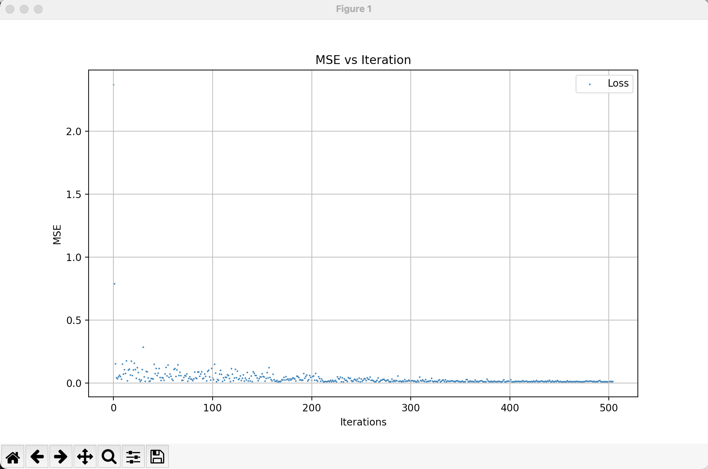
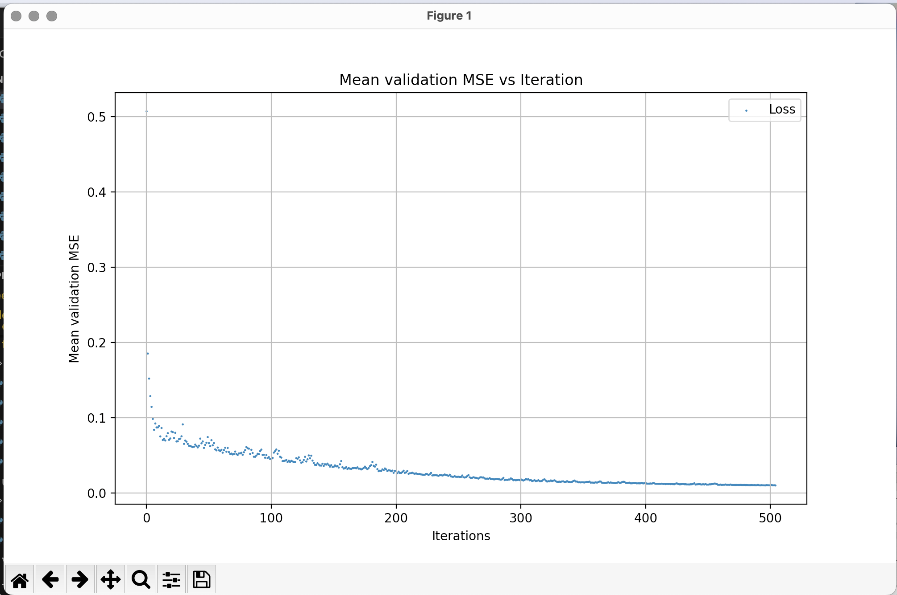

# deepl

A deep learning library for training end-to-end Artificial Neural Networks (ANNs), primarily based on `numpy` and `autograd`. (This is a very small 2-day project for learning purposes.)

## Features

### Network Structure
- `Dense_ANN`, `Dense_Layer`

### Weights and Bias Initialization Models
- `zero_init`, `uniform_init`, `xavier_init`, `he_init`, `variance_scaling_init`, `constant_init`

### Activation Functions
- `sigmoid`, `tanh`, `relu`, `leaky_relu`, `elu`, `swish`, `fixed_point`

### Output Evaluation and Loss Functions
- `mse` (Mean Squared Error), `mae` (Mean Absolute Error), `binary_cross_entropy`, `hinge_loss`

### Optimizer
- `SGD_Optimizer` (Stochastic Gradient Descent) capable of training fully connected ANNs.

### Regulizers
- `L1 (lasso)`, `L2 (ridge)`, `Elastic Net`

### Callbacks
- `stop_loss_min`, `lr_scheduler`, `checkpoints`

### Performance Visualization
- `loss_plot`, `mean_validation_plot`

## Limitations
- Uses mostly `numpy` with `autograd`, which does not take advantage of GPU and parallelism as modern libraries would.
- Only implements end-to-end training, not model-based deep learning.

## How to use
- `git clone https://github.com/AFLProjects/deepl.git`
- `cd deepl`
- `python3 setup.py`
- `python3 example.py`

## Example

```python
from deepl import core
from deepl import training
from deepl import visualization
import autograd.numpy as np

# Example

# Define structure
structure = (3, 3, 3)
nn = core.Dense_ANN(structure, [core.relu, core.fixed_point])

# Training data
data_size = 16000
train_x = [np.random.rand(3) for _ in range(data_size)]
train_y = 100 * train_x

# Validation data
validate_size = 64
validate_x = [np.random.rand(3) for _ in range(validate_size)]
validate_y = 100 * validate_x

# Optimizer and parameters
trainer = training.SGD_Optimizer(nn,
                                 loss=training.mse,
                                 init=core.uniform_init,
                                 init_args=(0, 1),
                                 start_lr=0.1,
                                 callbacks=[training.stop_loss_min,
                                            training.checkpoints],
                                 callback_args=[(10e-3,),
                                                (250,)],
                                 validate_x=validate_x,
                                 validate_y=validate_y,
                                 reg=training.lasso,
                                 reg_params=(0.001,))

# Train
weights_tensor, loss_values = trainer.train(train_x, train_y, data_size)

# Plots
visualization.loss_plot(trainer, 0.5, 'MSE')
visualization.mean_validation_plot(trainer, 0.5, 'MSE')
```

<div style="display: flex; justify-content: space-between;">
    
    
</div>

Performance for this specific case( (3,3,3) ) : 
__init__ took 8.833e-06 seconds
uniform_init took 2.813e-05 seconds
__init__ took 6.354e-05 seconds
train took 9.781e-01 seconds


